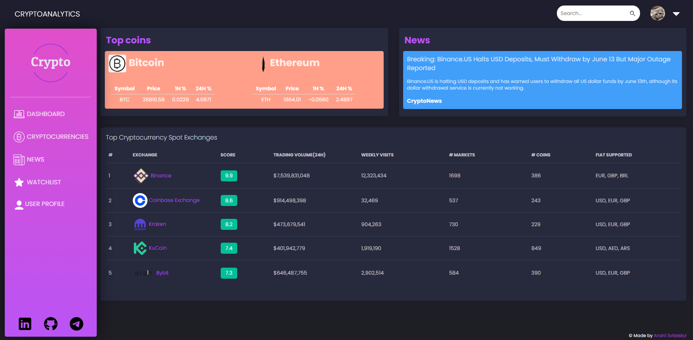

# Crypto Analytics
Django website

<a href="https://cryptoanalytics.fly.dev/">Visit CryptoAnalytics</a>

<a href="https://youtu.be/GZOj1R0q5mc">Video. What you can do on CryptoAnlytics?</a>

<h3>So this is a platform for your Cryptocurrency routine and here you can:</h3>
<ul>
  <li>Sign up and Reset Password</li>
  <li>Confirm your email to Log in</li>
  <li>Monitor Coin Rates, News, Exchanges</li>
  <li>Download coin rates to csv</li>
  <li>Search for a coin by its name</li>
  <li>Add coins to your Watchlist</li>
  <li>You are able to update your profile and upload avatar</li>
  <li>You can quickly change your password and email</li>

</ul>  

  
  
  

I used the next technologies and packages
<ul>
  <li>Python</li>
  <li>Django</li>
  <li>JavaScript</li>
  <li>HTML/CSS</li>
  <li>Postgres</li>
  <li>SQLAlchemy</li>
  <li>Third-party APIs</li>
  <li>Cloudinary</li>
  <li>Docker</li>
</ul>  

